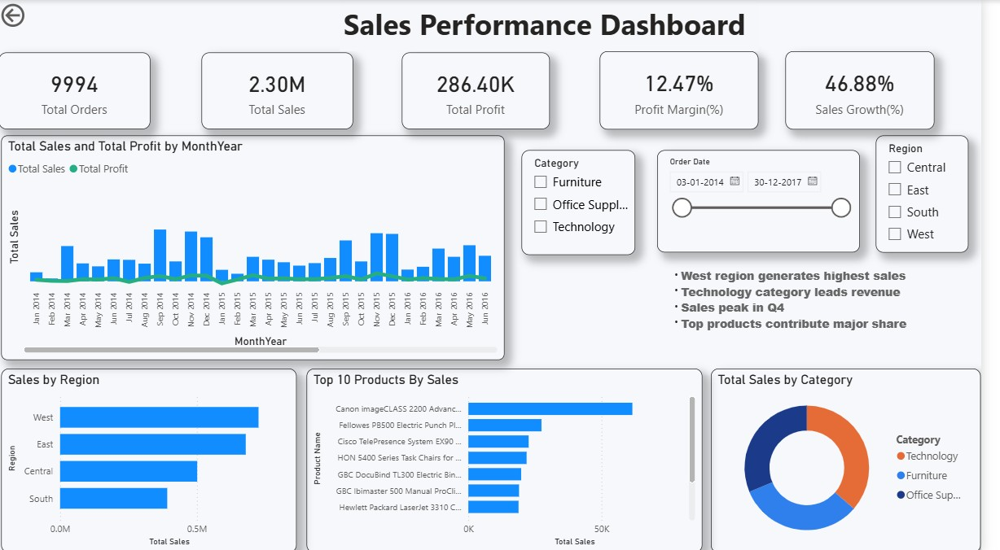

# sales-performance-dashboard (Power BI)

## 📊 Project Overview
This project presents an interactive Sales Performance Dashboard built using Power BI to analyze sales, profit, and growth trends.

## 🚀 Key Features
- KPI tracking: Total Sales, Profit, Profit Margin, Sales Growth
- Sales trend analysis over time
- Region-wise and category-wise performance
- Top 10 products analysis
- Interactive filters (Region, Category, Date)

## 🛠️ Tools Used
- Power BI
- DAX
- Power Query

## 📁 Files Included
- SalesDashboardBI (.pbix)
- Superstore Sales Dataset (.csv)
- Sales Performance Dashboard

## 📸 Dashboard Preview

## 📈 Insights
- West region generates highest sales
- Technology category leads revenue
- Sales peak in Q4
- Top products contribute major share
